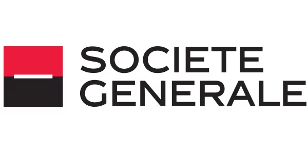
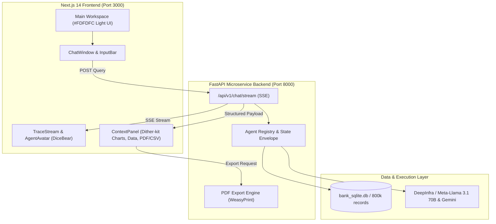
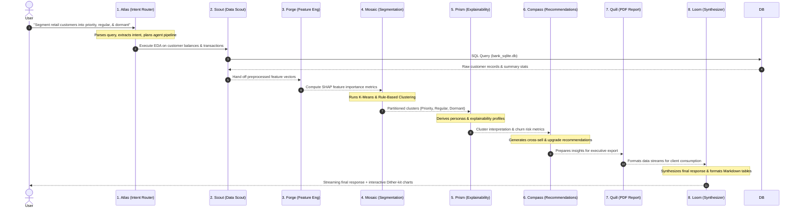

<div align="center">
  
  <span style="font-size: 28px; font-weight: bold; margin: 0 30px; vertical-align: middle; color: #a1a1aa;">×</span>
  
</div>

<br />

# Segwise — Customer Segmentation & Personalization Copilot

[](https://nextjs.org/)
[](https://fastapi.tiangolo.com/)
[](https://www.python.org/)
[](https://www.sqlite.org/)
[](https://www.dicebear.com/)

An enterprise-grade, multi-agent AI copilot designed for retail banking analytics. Segwise automates exploratory data analysis (EDA), customer segmentation, SHAP feature importance calculation, churn risk breakdown, and personalized product recommendation strategies on high-volume customer databases (800,000+ accounts).

---

## System Architecture

Segwise utilizes a decoupled 3-column client-server architecture. The frontend streams agent reasoning traces via Server-Sent Events (SSE) from a FastAPI microservice backend connected to a relational customer database (`bank_sqlite.db`).



---

## 8-Agent Orchestration Flow

Rather than a single prompt-response LLM, Segwise deploys an **8-agent specialized pipeline** simulating an entire bank data analytics department:



### Agent Roles & Responsibilities

| Agent Avatar | Name | Role | Responsibilities |
| :---: | :--- | :--- | :--- |
|  | **Atlas** | Intent & Planning | Parses user query, determines pipeline requirements, handles HITL clarifications. |
|  | **Scout** | Data Scout | Queries `bank_sqlite.db`, resolves columns, calculates missing values & statistics. |
|  | **Forge** | Feature Engineer | Computes SHAP feature importance, balance-to-spend ratios, and digital engagement scores. |
|  | **Mosaic** | Segmentation Engine | Executes K-Means clustering and business rule-based customer partitioning. |
|  | **Prism** | Explainability | Explains segment membership criteria, persona traits, and churn risk factors. |
|  | **Compass** | Recommendations | Identifies upgrade candidates (Regular → Priority) and cross-sell banking products. |
|  | **Quill** | PDF Report Generator | Compiles insights into a formal PDF report. |
|  | **Loom** | Synthesizer | Compiles all agent outputs into formatted markdown, tables, and executive summaries. |

---

## Key Features

- **Pristine `#FDFDFC` Light UI**: Designed using Emil Kowalski and Apple Design engineering principles (`scale(0.97)` active press feedback, sub-200ms spring animations).
- **Client-Side DiceBear Shape-Grid Avatars**: Local Data URI generation (`@dicebear/core` + `@dicebear/shape-grid`) for 0-latency, 100% offline avatar rendering dynamically matched to agent theme colors.
- **Dynamic Dither-kit Charts**: Implemented `@dither-kit/cli` composable charts that automatically adapt their color palette to match the generating agent (e.g., Forge uses a purple palette, Mosaic uses emerald green).
- **Real-Time Agent Execution Trace**: Streaming visual feedback with typewriter caret, dot-bounce indicators, and progress shimmers reflecting Live Agent Statuses.
- **Context Panel Controls**: Toggleable right panel displaying interactive dithered charts, customer record tables, and PDF export buttons.
- **Multi-Model Registry**: Hot-swap between state-of-the-art LLMs (Gemini, Llama 3.1 70B) natively through the backend execution envelope.
- **Human-In-The-Loop (HITL)**: Interactive clarification cards when ambiguous query parameters are encountered.
- **Executive PDF & CSV Exports**: Generate comprehensive 9-section PDF reports or export segment data directly to CSV.

---

## Repository Structure

```
segwise/
├── backend/
│   ├── agents/            # 8 specialized AI agents (Atlas..Loom)
│   ├── db/                # SQLite database connection & seed data
│   ├── routers/           # FastAPI SSE stream & REST endpoints
│   ├── services/          # PDF report compiler & CSV exporter
│   ├── tools/             # EDA, Feature Selection, K-Means & Explainability
│   ├── main.py            # FastAPI entrypoint (Port 8000)
│   └── requirements.txt   # Python dependencies
├── frontend/
│   ├── app/               # Next.js 14 App Router, globals.css, layout.tsx
│   ├── components/        # Chat, Agent Trace, Context Panel, Sidebar, Dither-kit
│   ├── lib/               # API client, types, SSE event parsers
│   └── package.json       # Node.js dependencies
├── problem_statement.txt  # Core business requirements & evaluation criteria
└── README.md
```

---

## Local Setup & Installation

### Prerequisites

- **Node.js**: `v18.0.0` or higher
- **Python**: `v3.10` or higher
- **Git**: Installed

---

### Step 1: Clone the Repository

```bash
git clone https://github.com/puang59/segwise.git
cd segwise
```

---

### Step 2: Backend Setup (FastAPI)

1. Navigate to the backend directory:
   ```bash
   cd backend
   ```

2. Create and activate a Python virtual environment:
   ```bash
   # On macOS/Linux
   python3 -m venv venv
   source venv/bin/activate

   # On Windows
   python -m venv venv
   venv\Scripts\activate
   ```

3. Install backend dependencies:
   ```bash
   pip install -r requirements.txt
   ```

4. Configure Environment Variables:
   Create a `.env` file inside the `backend` folder (optional for default local models):
   ```env
   DEEPINFRA_API_KEY=your_deepinfra_api_key_here
   GEMINI_API_KEY=your_gemini_api_key_here
   ```

5. Start the FastAPI development server:
   From the project root directory (`segwise/`):
   ```bash
   uvicorn backend.main:app --reload --port 8000
   ```
   *(Or if inside the `backend/` directory: `PYTHONPATH=.. uvicorn main:app --reload --port 8000`)*

   The backend API will be live at `http://localhost:8000`. Test endpoint docs at `http://localhost:8000/docs`.

---

### Step 3: Frontend Setup (Next.js 14)

1. Open a new terminal window and navigate to the frontend directory:
   ```bash
   cd frontend
   ```

2. Install Node modules:
   ```bash
   npm install
   ```

3. Start the Next.js development server:
   ```bash
   npm run dev
   ```
   The frontend UI will be live at `http://localhost:3000`.

---

## Example Queries to Test

Try entering these natural language prompts into the chat input bar:

1. **Customer Segmentation Query**:
   > *"Segment retail customers into priority, regular, and dormant tiers based on balance maintained and transaction frequency."*

2. **Explainability & Persona Query**:
   > *"On what basis were priority customers selected and what are their key traits?"*

3. **Aggregation & EDA Query**:
   > *"What is the average transaction size and balance for priority vs regular customers?"*

4. **Recommendation & Cross-Sell Query**:
   > *"Which regular customers can be converted into priority customers? What strategy should be used?"*
